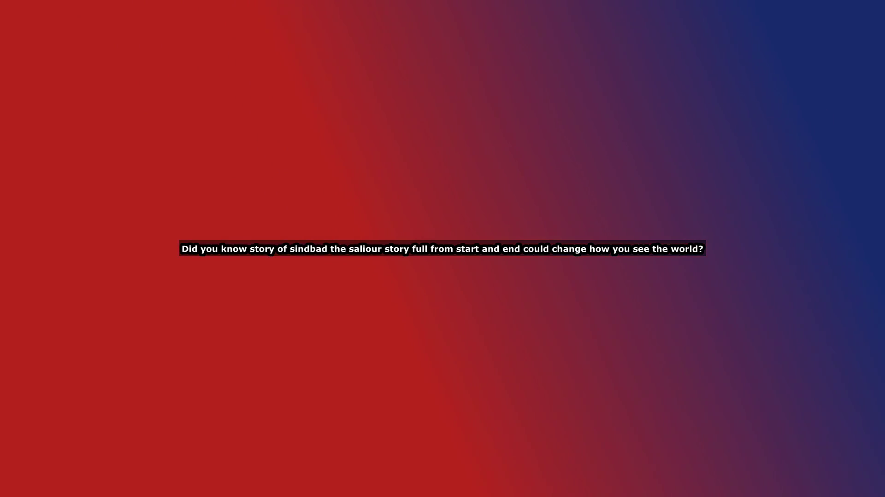

# 🎬 Auto Shorts — AI Short-Video Generator

Turn a single topic or keyword into a finished, ready-to-post social video —
**fully automated**. Give it _"the benefits of reading"_ and it generates the
script, finds background footage, narrates it with text-to-speech, burns in
styled subtitles, and mixes in background music. Output is HD in either
**vertical 9:16** (TikTok / Reels / YouTube Shorts) or **horizontal 16:9**
(YouTube).

Built with **Python + Flask** and a tiny vanilla-JS web UI.




## ✨ Features

- **AI script generation** via Google Gemini (with a built-in free template
  fallback so it works even with **no API key**).
- **Free text-to-speech** using `edge-tts` (no key, many voices).
- **Stock footage** from Pexels / Pixabay when you provide a free API key,
  otherwise automatically generated procedural background clips (also free).
- **Burned-in subtitles** with customizable font, size, color, outline,
  position, box, and a karaoke-style word highlight.
- **Background music** — drop your own track in `assets/music/`, or a soft
  ambient pad is synthesized for free.
- **Customizable** voice, music volume, and orientation from the UI.
- Rendered with **ffmpeg** at 1080×1920 / 1920×1080, 30 fps.

## 🚀 Setup

> Requires **Python 3.11+** and **ffmpeg** on your `PATH`.

```bash
# 1. Clone / open the project
cd auto-shorts

# 2. Create a virtual environment
python -m venv venv
.\venv\Scripts\Activate.ps1        # Windows
# source venv/bin/activate         # macOS / Linux

# 3. Install dependencies
pip install -r requirements.txt

# 4. (Optional) add API keys for Gemini + stock video
copy .env.example .env
#   edit .env and set GEMINI_API_KEY, PEXELS_API_KEY, PIXABAY_API_KEY
#   (all optional — the app runs fully free without them)

# 5. Run it
python app.py
```

Open <http://127.0.0.1:5000> in your browser, type a topic, and hit
**Generate video**.

### Using a Gemini API key (recommended)
Get a free key at <https://aistudio.google.com/apikey> and put it in `.env`:
```
GEMINI_API_KEY=your_key_here
GEMINI_MODEL=gemini-2.0-flash
```
Without a key the app still produces videos using a built-in script template.

### Using real stock footage
Add a free key from [Pexels](https://www.pexels.com/api/) or
[Pixabay](https://pixabay.com/api/docs/) to `.env`. If no key is set, the app
generates gradient background clips automatically.

### Bring your own assets
- Drop `.mp4` / `.mov` clips into `assets/clips/` → they are used as
  backgrounds (cycled per sentence).
- Drop a music file (`.mp3` / `.wav` / `.ogg`) into `assets/music/` → it is
  looped as the soundtrack (random pick).

## 🗂️ Project layout

```
auto-shorts/
├── app.py                 # Flask server + SSE progress API
├── config.py              # paths & settings (reads .env)
├── src/
│   ├── script_gen.py      # Gemini + template fallback
│   ├── tts.py             # edge-tts narration
│   ├── stock.py           # Pexels/Pixabay or procedural clips
│   ├── subtitles.py       # ASS subtitle styling
│   ├── music.py           # ambient synth / local music
│   └── video_builder.py   # ffmpeg assembly
├── static/                # web UI (index.html, app.js, style.css)
├── assets/                # optional user clips/ & music/
├── output/                # generated videos (gitignored)
└── samples/               # example outputs for the README
```

## 🔧 How the pipeline works

1. **Script** — Gemini writes a hook → 3 points → CTA as short caption lines
   (one line per subtitle). Falls back to a template offline.
2. **Voiceover** — `edge-tts` narrates each line; sentence timings drive the
   subtitle sync.
3. **Footage** — one background clip per line (stock API or generated gradient
   with slow zoom).
4. **Subtitles** — an ASS file is built from your style options and burned in.
5. **Music** — ambient pad (or your track) mixed under the narration at the
   chosen volume.
6. **Render** — ffmpeg cover-scales clips, burns subtitles, mixes audio, and
   exports HD MP4.

## 📦 Sample output

- `samples/sample_vertical.mp4` — 9:16 short
- `samples/sample_horizontal.mp4` — 16:9 short

## ⚠️ Notes
- For production deployments use a real WSGI server (e.g. `gunicorn`) instead
  of Flask's dev server.
- `google-generativeai` is only needed if you set `GEMINI_API_KEY`; install it
  separately with `pip install google-generativeai` when required.
